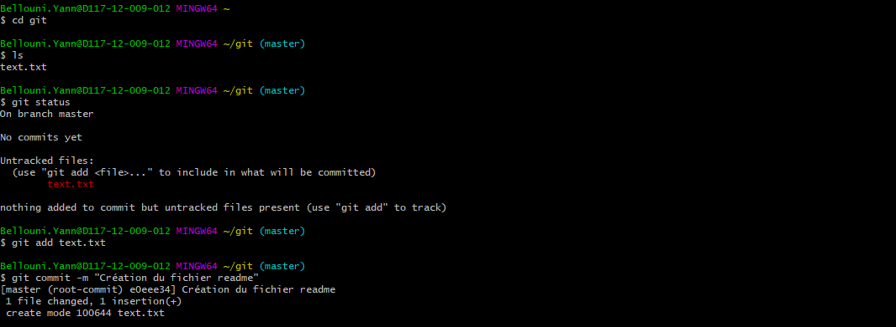
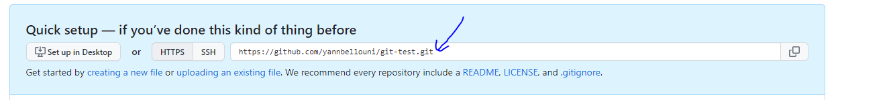

# Git and Github Cheatsheet
> **Consignes :**  
> Dans ce fichier vous créerez un pense-bête sur ce qui est important de retenir dans l'utilisation de Git et Github, comme gestionnaire de version et plateforme de partage et développement collaboratif en ligne.  
> Votre README devra comporter des parties et des sous parties, des extraits de code, des listes, des screenshots (dans le dossier assets) ... 
> Soyez exhaustif, ce repository est pour vous, il sera votre antisèche durant toute votre vie de développeur ! 
> Have fun ! 😉

# Git-it

## <u>Lancer le terminal :</u>

<b><i><u>git --version</u></i></b> permet de savoir la version de git installer sur l'ordinateur

## <u>Pour s'associer au travail sur github :</u>

Il faut rentrer ces commandes sur le terminal :

pour lier le pseudo utilisateur github :
<b><i><u>git config --global user.name "yannbellouni"</u></i></b>

pour lier l'adresse mail utilisateur github :
<b><i><u>git config --global user.email "yann.bellouni@e.rascol.net"</u></i></b>

## <u>Création d'un dépot git :</u>

un dépôt Git est un dossier suivi par Git, git peut suivre les modifications apporté à ce dépot, cela s'appelle la gestion de version.

pour créer un dépot, il faut d'abord aller dans un dossier dans à l'aide de git bash.

il faut ensuite utiliser la commande : <b><i><u>git init</u></i></b> qui va initialiser le contenu du dossier et créer un dépot.

## <u>Vérifier l'état + ajouter et soumettre les modifications</u>

si des modifications ont été apportés au dossier ou le depot git se situe.

en utilisant la commande : <b><i><u>git status</u></i></b>

on peut savoir si le dossier à subit des modifications et quelles sont les modifications qui n'ont pas été initialiser dans le dépot.

Si un seul fichier a été ajouter, on peut utiliser la commande : <b><i><u>git add readme.txt</u></i></b>

qui va initialiser le fichier dans le dépot git.

quand cette initialisation est faite, on peut utiliser la commande :
<b><i><u>git commit -m "Création du fichier readme"</u></i></b>

qui permet d'envoyer le dépot modifier sur le compte github initialiser précédemment.

Si on modifie le fichier texte sans le commit, on peut utiliser la commande :
<b><i><u>git diff</u></i></b>

qui permet de voir les modifications ajouté dans le fichier par rapport a la dernier initialisation dans le dépot.

## <u>Ajouter le nom d'utilisateur github à la configuration git :</u>

Après avoir créer le compte github,

il faut utiliser la commande : <b><i><u>git config --global user.username username
</u></i></b>

pour vérifier si la commande est passé on peut utiliser cette commande : <b><i><u>git config --global user.username</u></i></b> qui affiche le pseudo inscrit si tout s'est bien passé.

## <u>Remote control :</u>

Il faut d'abord créer un dépot distant sur github pour cela il faut :

- Aller à github.com , connectez-vous, puis cliquez sur '+' dans le haut À droite, puis cliquez sur 'New repository'.
- Donnez-lui un nom qui correspond au nom de votre dépôt local, 'hello-world', et une brève description.
- Rendez-le public. Cela signifie qu'il sera répertorié sur votre profil public.
- Ne pas initialiser avec un README car nous avons déjà un fichier, localement, nommé "readme.txt". Cette option de GitHub peut vous aider si vous ne l'aviez pas encore fait.
- Laissez «.gitignore» et «licence» définis sur «none». Nous n'utiliserons pas ces options dans ce tutoriel.
- Cliquer enfin sur "create repository"!

Il faut ensuite lier le dépot local au projet créer sur github pour cela, il faut aller dans le projet créer, récuperer l'url proposé dans quick startup en haut de la page.

Il faut ensuite utiliser dans git bash, la commande : <b><i><u>git remote add origin url</u></i></b> pour lier le dossier local au projet github pour linux.

pour windows :

<b><i><u>git remote set-url origin url</u></i></b>

Pour mettre le dossier git sur le pc dans le projet github, il faut utiliser la commande : <b><i><u>git push origin master</u></i></b> dans le dossier ou se trouve le dépot.

## <u>Utilisation de fork et les clones github :</u>

Un fork est une option présente dans github qui permet de copier un projet public dans nos projets personnels.

On peut cloner ce fork dans l'ordinateur localement,
pour cela il faut récuperer l'url du fork,
il faut ensuite utiliser la commande : <b><i><u>git clone url</u></i></b>

Cette commande telecharge le fork sur l'ordinateur.
on peut ensuite aller dans le dossier fork et rentrez la commande : <b><i><u>git remote -v</u></i></b>
qui permet de verifier si l'adresse distante github est bien configurer.

On peut utiliser cette commande si : <b><i><u>git remote add upstream https://github.com/jlord/patchwork.git</u></i></b> si le projet publique à subit des modifications, ce qui permet d'initialiser le fork.

## <u>Les branches :</u>

Créer une branche, c’est en quelque sorte comme créer une “copie” de son projet pour développer et tester de nouvelles fonctionnalités sans impacter le projet de base.

Pour créer une branches, il faut utiliser la commande : <b><i><u>git branch nombranche</u></i></b>

Pour travailler sur une branche, il faut utiliser la commande : <b><i><u>git checkout nombranche</u></i></b>

Pour initialiser les modifications de cette branche dans le fork, il faut utiliser cette commande : <b><i><u>git push origin nombranche</u></i></b>

## <u>collaborateur :</u>

Pour inviter un utilisateur au projet, il faut aller sur la la page github du projet, appuyer sur settings du projet, collaborators puis add people, il faut ensuite rentrer le nom de l'utilisateur à ajouter dans le projet.

## <u>voir modification en fonction du collaborateur :</u>

Il faut utiliser cette commande :
<b><i><u>git pull origin nombranche</u></i></b>

si rien à changer Already up to date s'affiche.

## <u>Créer des pull request :</u>

Les pull request permettent de partager ses mises à jour pour qu'elles bénéficient à tous.

Pour ce faire, il faut Visitez le dépôt d'origine.

- Cliquez sur 'New pull request'

- Sélectionnez la branche avec les modifications que vous souhaitez soumettre. Ce devrait être 'add-yourusername'.

Si tout sur la page semble correct :

- Cliquez sur 'Create pull request'

- Ajoutez un titre et une description aux modifications que vous proposez à l'auteur original.

- Cliquez enfin sur 'Send pull request'!

## <u>Fusionner des branches localement :</u>

Pour fusionner des branches, il faut d'abord selectionner la branches à fusionner avec cette commande : <b><i><u>git checkout gh-pages</u></i></b>

pour fusionner il faut selectionner une autre branche, la commande pour faire cela est : <b><i><u>git merge nombranche</u></i></b>

La branches sont fusionner, pour effacer localement la branche de fonctionnalité soit celle qui sert plus à rien vu qu'elle a été fusionner avec l'autre, la commande pour faire cela est : <b><i><u>git branch -d nombranche</u></i></b>

Pour effacer cette branche dans le projet github, il faut utiliser la commande : <b><i><u>git push origin --delete nombranche</u></i></b>

Pour tirer depuis le dépôt original sur le remote upstream:

il faut utiliser cette commande :

<b><i><u>git pull upstream nombranche</u></i></b>